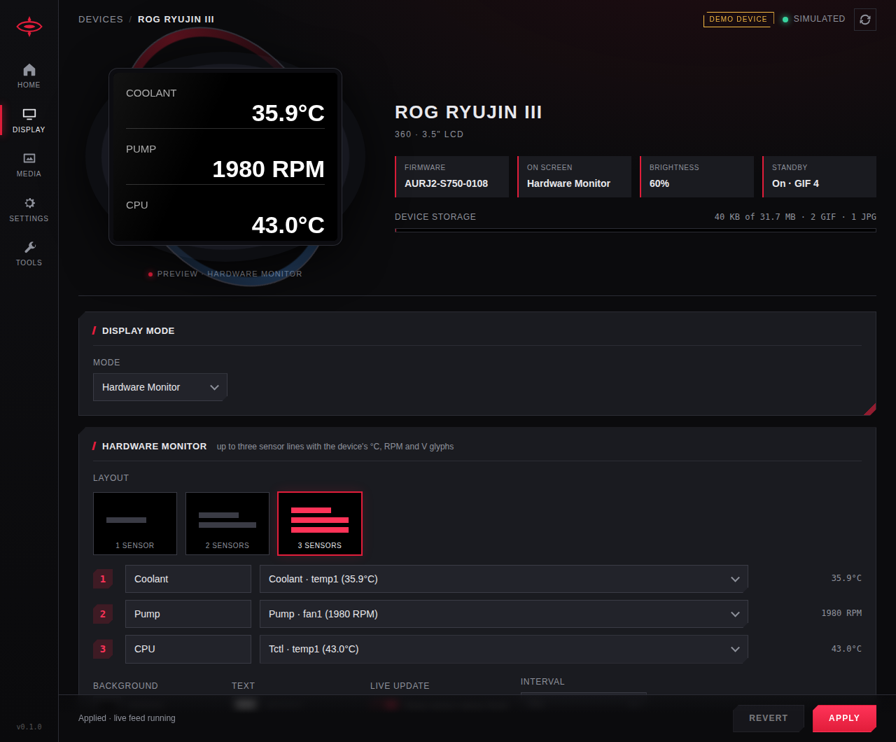

# ryujin-iii-lcd-linux

Drive the 3.5" LCD of the **ASUS ROG Ryujin III** AIO cooler (USB `0b05:1aa2`,
firmware `AURJ2-S750-0108`) from Linux, without Armoury Crate.

The protocol was captured from Armoury Crate and then replayed and checked on the
panel from Linux. Nothing public implemented it before: liquidctl's
`set_screen` for this cooler raises "not yet reverse engineered" and the kernel's
`asus_rog_ryujin` hwmon driver leaves the screen to userspace. The full write-up
is [docs/protocol.md](docs/protocol.md); the raw material (parsed HID timeline,
bulk payloads, device-only pcapng, capture runbook) is in [capture/](capture/).

What works, all verified on the hardware:

- brightness, standby settings
- the hardware-monitor page: up to three label/value lines with the device's
  °C, RPM and V glyphs
- upload of GIFs (tested with 400 KB, 30 frames) and JPEGs into the cooler's own
  storage (16 slots each, Armoury Crate uses 10), and deleting them
- playing a stored GIF, showing a stored JPEG, optionally with up to six lines of
  text (color, alpha, left/right alignment)
- the clock page, 12 or 24 hour
- reading back firmware, display status, storage table and the current item

The device keeps playing whatever was last selected, with no host involvement,
across reboots.

There is a command-line tool and a web control panel in the style of Armoury
Crate (below).

## Install

```
git clone https://github.com/zaclanzon/ryujin-iii-lcd-linux && cd ryujin-iii-lcd-linux
./install.sh                                  # venv + deps, udev rule (sudo), wrappers in ~/.local/bin
ryujin-lcd info
ryujin-lcd-web                                # http://127.0.0.1:8686/
```

`install.sh` builds a private virtualenv under `~/.local/lib/ryujin-lcd` with the Python
dependencies (pyusb, and Pillow to resize images) and symlinks wrappers into `~/.local/bin`,
so the system Python is untouched and no distro packages are needed. It runs on any distro
with `python3` and its `venv` module; `pipx install .` works too. The one system library is
libusb (Debian `libusb-1.0-0`, Fedora `libusbx`, Arch `libusb`), usually already present.

The udev rule tags the cooler's hidraw node and its raw USB node (the vendor bulk interface
carries the file data) with `uaccess`, so systemd-logind grants your active local session
access on any distro. Without the rule, run everything as root.

The tool coexists with the `asus_rog_ryujin` hwmon driver on the same HID
interface: it skips the driver's replies and the driver ignores the LCD replies.
Mainline has the Ryujin III but not yet USB PID `0x1aa2`; a patch was sent to
linux-hwmon in September 2026.

### Pump duty: leave it to the motherboard header

Nothing here writes pump or fan duty, on purpose. The Ryujin III has a 4-pin pump cable
to a motherboard fan header, and until the first duty command over USB the pump follows
that header's BIOS curve (confirmed with `nct6775`: the header PWM tracks CPU temperature
and the pump tracks the PWM). The first duty write of any kind, from liquidctl, the hwmon
driver's `pwm1`/`pwm2` or `fancontrol`, takes the pump off the header, and on this firmware
it then runs at maximum while still reporting the old 40 % duty, until `pwm1` (liquidctl
`set pump`) is written with a value different from the one it reports. Only a power cycle
returns the pump to the header. Tracked in
[liquidctl#923](https://github.com/liquidctl/liquidctl/issues/923) and
[asus_rog_ryujin-hwmon#12](https://github.com/aleksamagicka/asus_rog_ryujin-hwmon/issues/12);
whether the Extreme, EVA and White variants behave the same is untested.

## Use

```
ryujin-lcd info
ryujin-lcd brightness 60
ryujin-lcd hwmon "Coolant=40.9°C" "Pump=1920 RPM" "CPU=1.066V"
ryujin-lcd upload cat.gif gif 0 --show      # cropped and resized to 320x240
ryujin-lcd upload photo.jpg jpg 0 --show
ryujin-lcd show gif 0
ryujin-lcd banner jpg 0 "line one" "line two" --color FF0000FF --align 1 --x 312
ryujin-lcd clock --24h
ryujin-lcd delete jpg 0
ryujin-lcd raw DC                          # any command, prints the reply
ryujin-lcd monitor 10                      # dump incoming reports for 10 s
```

`-v` prints every report on the wire.

### Live sensor page

`ryujin-lcd-monitor` keeps the hardware-monitor page fed from hwmon and re-sends
only when a value changes:

```
ryujin-lcd-monitor Coolant=rog_ryujin/temp1 Pump=rog_ryujin/fan1 CPU=k10temp/temp1
./install.sh --monitor            # same thing as a user service, reading ~/.config/ryujin-lcd/monitor.conf
```

Lines are `LABEL=HWMON/SENSOR` where `HWMON` is the driver name in
`/sys/class/hwmon/*/name` and `SENSOR` the attribute without `_input`
(`temp1`, `fan2`, `in0`, `power1`, ...). Up to three lines. When several devices
share a name (three NVMe drives are all `nvme`), `HWMON` can be `NAME:DEVICE`
with `DEVICE` the basename of `/sys/class/hwmon/hwmonN/device`, e.g.
`nvme:nvme1`; the web panel lists them that way.

## Web control panel



`ryujin-lcd-web` serves a single-page control panel that follows the layout of the
Armoury Crate device page: a preview of the LCD on the pump head, the display
mode (Hardware Monitor with layout tiles and hwmon sensor pickers, or Customized
Slideshow with Animation / Wallpaper / Time), banner text over a wallpaper, a
media library with upload, crop and delete, the brightness slider and standby
settings, and a tools page with the raw status bytes and a raw command console.

```
ryujin-lcd-web                     # http://127.0.0.1:8686/
RYUJIN_LCD_TOKEN='replace-with-a-long-random-token' ryujin-lcd-web --host 0.0.0.0
ryujin-lcd-web --demo              # simulated cooler and sensors, no hardware needed
./install.sh --web                 # run it as a user service (replaces the monitor service)
```

Loopback access needs no token. A non-loopback bind is refused unless `--token`
or `RYUJIN_LCD_TOKEN` is set. Open the remote panel once with a URL whose fragment
is `http://HOST:8686/#token=` followed by `encodeURIComponent(TOKEN)` (or paste a
token containing no reserved URL characters directly); the panel decodes the entire
suffix, moves the token into session storage, and removes it from the address bar.
The built-in server is plain HTTP, so use a trusted LAN or put it behind an HTTPS
reverse proxy. The server also refuses requests whose `Host` header is not the
loopback address it listens on, so a web page cannot reach it through DNS rebinding.

The server is the Python standard library only; Pillow is needed to crop and
resize uploads. Applied settings are saved in `~/.config/ryujin-lcd/web.json`,
uploaded media are kept in `~/.local/share/ryujin-lcd/media` for the thumbnails
(the cooler cannot send files back). "Live update" on the hardware-monitor page
starts a sensor feed inside the server, equivalent to `ryujin-lcd-monitor`, and
the web service is declared to conflict with the monitor service so only one of
them drives the page. At start the server re-applies what needs the host: it
restarts the live feed, sets the clock again, and resumes a multi-animation
slideshow (`--no-restore` skips this); a single stored animation or wallpaper
keeps playing by itself. Pick several animations in Customized Slideshow to
rotate through them at the chosen duration: the cooler was never seen to cycle a
list on its own, so the server drives it by playing each in turn (display
commands only, no writes to the cooler's storage), which means the rotation runs
only while the server is up. All device access is
serialized, so the page, the feed and an upload never interleave on the shared
HID interface. The API refuses cross-origin requests, so another web site open
in the same browser cannot drive the cooler through it.

A file that is on screen cannot be deleted: the cooler acknowledges the command
and keeps the file. The panel reports this; show something else first.

**Power-on default** (Settings page). The cooler resumes whatever was last selected
when it powers up, so a page driven from the host (Hardware Monitor, Clock, a
rotation) comes back empty at boot until the user service starts at login. Pick a
stored animation or wallpaper as the default and the service switches the LCD to it
when it stops (`systemctl --user stop`, logout, shutdown), then restores your display
mode when it starts. Display commands only, nothing is written to the cooler's storage.

### Migrating from another OS

The cooler never sends a file back (see [docs/protocol.md](docs/protocol.md)), so a slot
filled by the ASUS software shows as *no local copy* here. Armoury Crate keeps its own
copy of every upload, already converted to 320x240, plus a profile mapping each file to a
slot (`uploadImages[]` = id, `mediaIndex` = slot, `category` 0 gif / 1 jpg):

```
C:\Program Files (x86)\ASUS\ArmouryDevice\View\externalFiles\aio\RYUJIN_III\<id>.gif|jpg
C:\ProgramData\ASUS\Framework\aioFan\RYUJIN3\fp_1_config.xml
```

Those copies are byte-identical to what is on the device. Mount that system partition
read-only, stop the web service, and import them:

```
ryujin-lcd-web --import-crate /mnt     # prints each slot with size and frame count
```

It copies files into `~/.local/share/ryujin-lcd/media` for slots the cooler lists as used;
the panel shows them on its next storage refresh.

Check the result against the LCD. Armoury Crate never verifies its folder against the cooler,
so after a device-page update it can hold stale stand-ins (tiny single-frame GIFs) instead of
the real animations. For any slot the importer got wrong or does not know (files uploaded with
the `ryujin-lcd` CLI), use the Media page: *Show now* puts the slot on the LCD, *Set thumbnail*
attaches the matching file as a local copy only, without touching the cooler.

## Protocol in one paragraph

Two USB interfaces. Interface 1 is HID: every command is a 65-byte output report
(`EC` + 64 bytes) with one 64-byte reply, written straight to hidraw. Interface 0
is a vendor bulk pipe used only for file data, in 4096-byte writes, each
acknowledged by an `EE 14` event on HID. Media are addressed by (kind, source,
slot). Three things the capture alone got wrong and only the panel revealed:
brightness lives in byte 7 of the display-status report (Armoury Crate writes
byte 12, which does nothing), the hardware-monitor commit byte is the line count
minus one, and a stored JPEG is selected by the wallpaper background command,
not by the list entry Armoury Crate also sends. Details, byte layouts and the
still-unknown fields: [docs/protocol.md](docs/protocol.md).

## Status and contributions

Tested on one Ryujin III 360 with firmware 0108. Untested: the White / EVA /
Extreme variants (same HAL class in Armoury Crate, so probably identical),
portrait orientation, standby behavior, monitor-page colors. A liquidctl
`set_screen` implementation can be built directly from `ryujin_lcd/device.py`.
Issues and captures from other units welcome.

Written with Claude Fable 5.1.

## License

[MIT](LICENSE).
